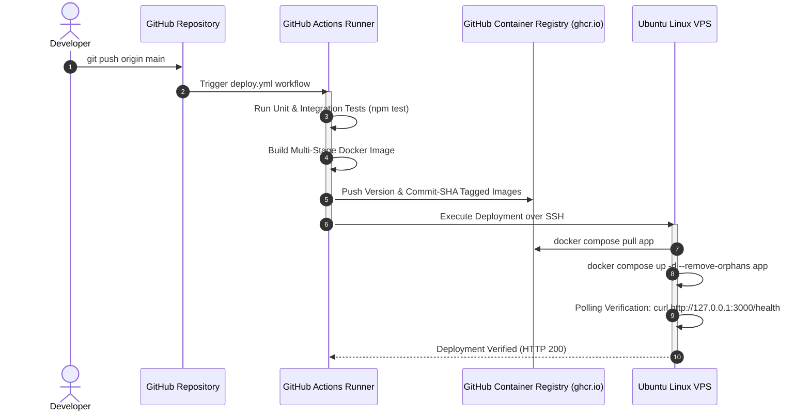

# ShipIt — Production-Grade URL Shortener & DevOps Showcase

ShipIt is a production-oriented URL shortener with click analytics, architected and built to demonstrate the complete software delivery lifecycle:

**Code → Testing → Docker → CI/CD → Container Registry (GHCR) → Ubuntu VPS → Nginx → HTTPS (Certbot) → Uptime Monitoring**

Rather than relying on black-box PaaS abstractions or toy in-memory state, ShipIt demonstrates enterprise-level Node.js development, PostgreSQL schema design with atomic click counting, multi-stage Docker builds, automated GitHub Actions pipelines, and bare-metal Ubuntu VPS administration over SSH with an Nginx reverse proxy.

---

## Live Demo

* **Web Application:** `https://[YOUR_DOMAIN_OR_VPS_IP]` *(Configurable placeholder until VPS deployment)*
* **Health Check Endpoint:** `https://[YOUR_DOMAIN_OR_VPS_IP]/health`
* **Status Page:** *(Configurable placeholder until UptimeRobot setup)*

---

## Project Overview

* **Short Code Generation:** Cryptographically sound, collision-resistant base62 generation using rejection sampling with retry mechanisms and database-level uniqueness enforcement.
* **Redirection & Atomic Analytics:** `GET /:code` atomically increments click counts and records last-clicked timestamps in a single PostgreSQL query.
* **REST API:** Complete CRUD lifecycle for URLs, paginated list view, and individual statistics.
* **Production Observability:** Structured logging, centralized error taxonomy, unmetered `/health` probing, and external uptime monitoring.
* **Infrastructure as Code & CI/CD:** Zero manual server patching; GitHub Actions tests, packages, publishes to GitHub Container Registry (GHCR), and deploys remotely to Ubuntu via SSH.

---

## Features

- [x] **Modular Express Architecture:** Strict separation between routes, controllers, services, database models, and middleware.
- [x] **Centralized Error Handling:** Standardized error formats without leaking database credentials or stack traces in production.
- [x] **Defensive Security:** Helmet header hardening, CORS configuration, 10kb request size boundaries, and tiered IP rate limiting.
- [x] **PostgreSQL Persistence & Migrations:** Explicit relational tables, unique constraints, and B-Tree indexing on short codes.
- [x] **Atomic Click Analytics:** Concurrency-safe counter increments via SQL expressions (`click_count = click_count + 1`).
- [x] **Comprehensive Test Suite:** 23 integration and unit tests using Jest and Supertest covering all endpoints, collisions, and rate limits.
- [x] **Production Dockerization:** Multi-stage, minimal, unprivileged container execution (`node:22-alpine` under `USER node`).
- [x] **CI/CD Pipeline:** Automated GitHub Actions build, test, and GHCR publishing with commit-SHA tagging.
- [x] **Self-Hosted VPS Deployment:** Ubuntu host management, automated provisioning script, UFW firewall, and Docker Compose supervision.
- [x] **Nginx Reverse Proxy & HTTPS:** TLS termination via Let's Encrypt / Certbot with HTTP-to-HTTPS redirection and security headers.
- [x] **External Uptime Monitoring:** Automated synthetic pings on `/health` via UptimeRobot.

---

## Architecture

### Application Architecture

```mermaid
graph TD
    Client(["Internet Client"]) -->|HTTPS :443| Nginx["Nginx Reverse Proxy (Ubuntu Host)"]
    Nginx -->|HTTP :3000 (Internal 127.0.0.1)| AppContainer["Node.js / Express Container"]
    AppContainer -->|PostgreSQL Protocol :5432| DBContainer["PostgreSQL Container"]
    DBContainer --> DBVolume[("Docker Named Volume\n(shipit_pgdata)")]
```

### CI/CD Deployment Architecture



---

## Tech Stack

* **Runtime:** Node.js (v20+ LTS / v24)
* **Framework:** Express.js
* **Database:** PostgreSQL 16 with `pg` connection pooling
* **Security & Middleware:** Helmet, CORS, Express-Rate-Limit, Morgan
* **Testing:** Jest, Supertest
* **Containerization:** Docker, Docker Compose
* **Container Registry:** GitHub Container Registry (GHCR)
* **CI/CD:** GitHub Actions
* **Host Operating System:** Ubuntu Linux LTS VPS
* **Reverse Proxy & SSL:** Nginx, Certbot (Let's Encrypt)
* **Monitoring:** UptimeRobot (external `/health` synthetic probing)

---

## Project Structure

```text
shipit/
├── .github/
│   └── workflows/
│       └── deploy.yml          # GitHub Actions CI/CD pipeline
├── nginx/
│   └── default.conf            # Nginx reverse proxy & SSL configuration
├── scripts/
│   └── vps-init.sh             # Automated VPS provisioning and hardening
├── src/
│   ├── config/
│   │   └── env.js              # Environment variables and config loading
│   ├── controllers/
│   │   ├── healthController.js # Health check logic
│   │   └── linkController.js   # Short link CRUD & redirect handlers
│   ├── db/
│   │   ├── index.js            # Connection pool & query helpers
│   │   ├── init.sql            # Schema for PostgreSQL Docker entrypoint
│   │   └── migrate.js          # Standalone database migrations
│   ├── middleware/
│   │   ├── errorHandler.js     # Centralized error & 404 middleware
│   │   ├── rateLimiter.js      # Endpoint & creation rate limiters
│   │   └── validator.js        # Input validation middleware
│   ├── routes/
│   │   ├── healthRoutes.js     # /health router
│   │   ├── linkRoutes.js       # /api/links router
│   │   └── redirectRoutes.js   # /:code redirection router
│   ├── services/
│   │   └── linkService.js      # Business logic & short code generation
│   ├── utils/
│   │   ├── errors.js           # Custom AppError hierarchy
│   │   ├── logger.js           # Structured logging
│   │   └── shortCode.js        # Base62 code generator with rejection sampling
│   ├── app.js                  # Express app & middleware composition
│   └── server.js               # HTTP listener & graceful shutdown
├── tests/
│   ├── health.test.js          # Health endpoint & error tests
│   └── links.test.js           # Complete link lifecycle tests
├── .dockerignore
├── .env.example
├── .gitignore
├── Dockerfile                  # Multi-stage production container build
├── docker-compose.yml          # Multi-container local & VPS setup
├── INTERVIEW.md                # Comprehensive 25-question interview guide
├── package.json
└── README.md
```

---

## Database Schema

```sql
CREATE TABLE IF NOT EXISTS links (
  id SERIAL PRIMARY KEY,
  original_url TEXT NOT NULL,
  short_code VARCHAR(16) NOT NULL UNIQUE,
  click_count INTEGER DEFAULT 0 NOT NULL,
  last_clicked_at TIMESTAMP WITH TIME ZONE NULL,
  created_at TIMESTAMP WITH TIME ZONE DEFAULT CURRENT_TIMESTAMP NOT NULL,
  updated_at TIMESTAMP WITH TIME ZONE DEFAULT CURRENT_TIMESTAMP NOT NULL
);

CREATE INDEX IF NOT EXISTS idx_links_short_code ON links(short_code);
```

### Schema Design Decisions
* **`short_code VARCHAR(16) UNIQUE`:** Guarantees uniqueness at the database engine level, functioning as the ultimate guard against application race conditions.
* **`idx_links_short_code`:** A B-Tree index on `short_code` enables $O(\log N)$ or index-only lookups for redirection, eliminating sequential table scans.
* **`click_count INTEGER`:** Updated atomically via `SET click_count = click_count + 1` during redirects.

---

## API Documentation

### 1. Health Check
* **Endpoint:** `GET /health`
* **Purpose:** Verifies application and database connectivity. Unmetered for uptime monitors.
* **Status Codes:**
  * `200 OK`: Application and database are operational.
  * `503 Service Unavailable`: Database is unreachable.
* **Response:**
  ```json
  {
    "status": "ok",
    "database": "connected",
    "uptime": 142.3,
    "timestamp": "2026-10-03T12:00:00.000Z"
  }
  ```
* **cURL Example:**
  ```bash
  curl -X GET http://localhost:3000/health
  ```

---

### 2. Create Short Link
* **Endpoint:** `POST /api/links`
* **Purpose:** Generates a short URL for a destination target.
* **Status Codes:**
  * `201 Created`: Successfully generated.
  * `400 Bad Request`: Validation failure (malformed URL, invalid protocol, exceeding 2048 chars).
  * `409 Conflict`: Short code collision retry exhausted.
  * `429 Too Many Requests`: Rate limit exceeded.
* **Request:**
  ```json
  {
    "url": "https://example.com/very/long/target/url"
  }
  ```
* **Response:**
  ```json
  {
    "id": 1,
    "originalUrl": "https://example.com/very/long/target/url",
    "shortCode": "k8X2a9",
    "shortUrl": "http://localhost:3000/k8X2a9",
    "clickCount": 0,
    "lastClickedAt": null,
    "createdAt": "2026-10-03T12:01:00.000Z",
    "updatedAt": "2026-10-03T12:01:00.000Z"
  }
  ```
* **cURL Example:**
  ```bash
  curl -X POST http://localhost:3000/api/links \
    -H "Content-Type: application/json" \
    -d '{"url":"https://example.com/very/long/target/url"}'
  ```

---

### 3. Short URL Redirection & Click Tracking
* **Endpoint:** `GET /:code`
* **Purpose:** Resolves short code, atomically increments click count, updates `last_clicked_at`, and redirects the user.
* **Status Codes:**
  * `302 Found`: Redirects to original URL (`Location` header).
  * `400 Bad Request`: Invalid short code format.
  * `404 Not Found`: Short code does not exist.
* **cURL Example:**
  ```bash
  curl -i -X GET http://localhost:3000/k8X2a9
  ```

---

### 4. Link Statistics
* **Endpoint:** `GET /api/links/:code/stats`
* **Purpose:** Retrieves analytics for a specific link without incrementing clicks.
* **Status Codes:**
  * `200 OK`: Stats retrieved.
  * `404 Not Found`: Short code does not exist.
* **Response:**
  ```json
  {
    "id": 1,
    "originalUrl": "https://example.com/very/long/target/url",
    "shortCode": "k8X2a9",
    "shortUrl": "http://localhost:3000/k8X2a9",
    "clickCount": 42,
    "lastClickedAt": "2026-10-03T12:15:30.000Z",
    "createdAt": "2026-10-03T12:01:00.000Z",
    "updatedAt": "2026-10-03T12:15:30.000Z"
  }
  ```
* **cURL Example:**
  ```bash
  curl -X GET http://localhost:3000/api/links/k8X2a9/stats
  ```

---

### 5. List Links (Paginated)
* **Endpoint:** `GET /api/links?page=1&limit=20`
* **Purpose:** Returns paginated list of created links.
* **Query Parameters:**
  * `page` (integer, default `1`): Page number.
  * `limit` (integer, default `20`, max `100`): Results per page.
* **Status Codes:**
  * `200 OK`: List retrieved.
  * `400 Bad Request`: Invalid page or limit parameter.
* **Response:**
  ```json
  {
    "data": [
      {
        "id": 1,
        "originalUrl": "https://example.com/very/long/target/url",
        "shortCode": "k8X2a9",
        "shortUrl": "http://localhost:3000/k8X2a9",
        "clickCount": 42,
        "lastClickedAt": "2026-10-03T12:15:30.000Z",
        "createdAt": "2026-10-03T12:01:00.000Z",
        "updatedAt": "2026-10-03T12:15:30.000Z"
      }
    ],
    "pagination": {
      "page": 1,
      "limit": 20,
      "total": 1,
      "totalPages": 1
    }
  }
  ```
* **cURL Example:**
  ```bash
  curl -X GET "http://localhost:3000/api/links?page=1&limit=10"
  ```

---

### 6. Delete Link
* **Endpoint:** `DELETE /api/links/:code`
* **Purpose:** Permanently deletes a short link.
* **Status Codes:**
  * `200 OK`: Successfully deleted.
  * `404 Not Found`: Link not found.
* **Response:**
  ```json
  {
    "message": "Link successfully deleted",
    "shortCode": "k8X2a9"
  }
  ```
* **cURL Example:**
  ```bash
  curl -X DELETE http://localhost:3000/api/links/k8X2a9
  ```

---

## Local Development

### 1. Prerequisites
- Node.js >= 20.x
- PostgreSQL >= 14 (or Docker)

### 2. Setup Steps
```bash
# 1. Clone repository
git clone https://github.com/your-username/shipit.git
cd shipit

# 2. Setup environment variables
cp .env.example .env

# 3. Install dependencies
npm install

# 4. Run automated tests
npm test

# 5. Run migrations (requires PostgreSQL running locally or in Docker)
npm run migrate

# 6. Start development server with file watching
npm run dev
```

---

## Environment Variables

| Variable | Description | Default |
|---|---|---|
| `NODE_ENV` | Application environment (`development`, `test`, `production`) | `development` |
| `PORT` | Local HTTP port | `3000` |
| `BASE_URL` | Base domain for generated short links | `http://localhost:3000` |
| `DATABASE_URL` | Complete PostgreSQL connection string (optional) | - |
| `POSTGRES_HOST` | Database hostname | `localhost` |
| `POSTGRES_PORT` | Database port | `5432` |
| `POSTGRES_DB` | Database name | `shipit` |
| `POSTGRES_USER` | Database username | `postgres` |
| `POSTGRES_PASSWORD` | Database password | `postgres` |
| `RATE_LIMIT_WINDOW_MS` | Rate limiting evaluation window in ms | `900000` (15m) |
| `RATE_LIMIT_MAX` | Max general API requests per window | `100` |
| `RATE_LIMIT_CREATE_MAX` | Max link creation requests per window | `30` |

---

## Running with Docker

Run the complete multi-container setup (Express application + PostgreSQL with persistent volume):

```bash
# Build images and start all containers in background
docker compose up -d --build

# Inspect running containers
docker compose ps

# View application logs
docker compose logs -f app

# Stop containers
docker compose down
```

---

## Testing

ShipIt uses Jest and Supertest for unit and integration testing.

```bash
# Run all tests
npm test

# Run tests in watch mode
npm run test:watch

# Generate code coverage report
npm run test:coverage
```

### Coverage Highlights
* **Health Check & Degradation:** Validates 200 OK when DB is healthy and 503 Service Unavailable when DB is disconnected.
* **Short Code Generation:** Validates base62 alphabet, length constraints, and rejection sampling.
* **Collision Handling:** Simulates PostgreSQL `23505` unique violation and verifies retry execution.
* **Atomic Analytics:** Confirms `UPDATE links SET click_count = click_count + 1` execution and 302 redirection.
* **Validation & Errors:** Checks malformed URLs, oversized payloads (>2048 chars), missing fields, and bad pagination parameters.
* **Rate Limiting:** Probes rate limiter threshold and confirms 429 response formatting.

---

## CI/CD Pipeline

The GitHub Actions workflow [`.github/workflows/deploy.yml`](file:///.github/workflows/deploy.yml) automates testing, packaging, and remote deployment:

1. **Trigger:** Push or Pull Request to `main` / `master`.
2. **Automated Testing:** Sets up Node.js 22, installs dependencies via `npm ci`, and executes `npm test`. Failure blocks the pipeline.
3. **Build & Push to GHCR:** On push to `main`, uses Docker Buildx to build the multi-stage image and publish it to `ghcr.io` tagged with Git commit SHA and `latest`.
4. **Automated VPS Deployment:** Connects over SSH, pulls the new SHA image, restarts the application with zero unnecessary downtime, and polls `http://127.0.0.1:3000/health` to verify success.

---

## GHCR (GitHub Container Registry)

Docker images are pushed to GitHub Container Registry:
`ghcr.io/<github-username>/shipit:<commit-sha>`

### Key Advantages:
* **Separation of Concerns:** Build steps and compilers are kept off the production server.
* **Native Authentication:** GitHub Actions authenticates seamlessly using the built-in `GITHUB_TOKEN`.
* **Immutable Deployments:** Tagging with Git commit SHA enables unambiguous version tracking and instant rollbacks.

---

## VPS Deployment

Production hosting uses an **Ubuntu 22.04 / 24.04 LTS VPS** (DigitalOcean, Hetzner, Linode, or Oracle Cloud).

### Automated VPS Provisioning
Run the provisioning script on a clean Ubuntu VPS:
```bash
# SSH into your VPS as root
ssh root@<YOUR_VPS_IP>

# Download and execute the automated setup script
curl -fsSL https://raw.githubusercontent.com/<username>/shipit/main/scripts/vps-init.sh -o vps-init.sh
sudo bash vps-init.sh
```

### Manual Configuration Steps
1. Place your production `.env` in `/opt/shipit/.env`:
   ```bash
   sudo nano /opt/shipit/.env
   sudo chmod 600 /opt/shipit/.env
   sudo chown deploy:deploy /opt/shipit/.env
   ```
2. Copy `docker-compose.yml` to `/opt/shipit/docker-compose.yml`.
3. Add the GitHub Actions deploy SSH public key to `/home/deploy/.ssh/authorized_keys`.

---

## Nginx

Nginx runs on the Ubuntu VPS host, serving as the reverse proxy:
* **Config Location:** [`nginx/default.conf`](file:///c:/ShipIt/nginx/default.conf) → `/etc/nginx/sites-available/shipit`
* **Port Forwarding:** Listens on port 80/443 and proxies traffic to `http://127.0.0.1:3000`.
* **Security:** Internal Node.js (3000) and PostgreSQL (5432) ports are blocked from public internet access by UFW.
* **Headers:** Injects `X-Real-IP`, `X-Forwarded-For`, and `X-Forwarded-Proto`.

```bash
# Link site and verify syntax
sudo ln -s /etc/nginx/sites-available/shipit /etc/nginx/sites-enabled/
sudo nginx -t
sudo systemctl reload nginx
```

---

## HTTPS

TLS certificates are issued and renewed automatically using **Let's Encrypt** and **Certbot**:

```bash
# Obtain and install SSL certificate
sudo certbot --nginx -d your-domain.com

# Verify automated renewal timer
sudo systemctl status certbot.timer

# Perform a dry-run renewal test
sudo certbot renew --dry-run
```

---

## Monitoring

### Uptime Monitoring with UptimeRobot
1. Create a free account at [UptimeRobot](https://uptimerobot.com/).
2. Add New Monitor:
   * **Monitor Type:** `HTTP(s)`
   * **Friendly Name:** `ShipIt Production API`
   * **URL:** `https://your-domain.com/health`
   * **Monitoring Interval:** `5 minutes` (or 1 minute)
3. Set alert contacts (Email, Slack, SMS).
4. If `/health` returns non-200 (e.g. 503 if PostgreSQL is disconnected, 502 if Node is down), UptimeRobot alerts immediately.

---

## Security

* **Unprivileged Containers:** Runs as `USER node` inside Docker.
* **Network Isolation:** PostgreSQL is bound only to internal Docker bridge network. Application port is bound only to `127.0.0.1:3000`.
* **Host Firewall (UFW):** Only ports 22 (SSH), 80 (HTTP), and 443 (HTTPS) are open.
* **Defensive HTTP Headers:** Helmet enforces CSP, HSTS, X-Content-Type-Options, and X-Frame-Options.
* **Request Throttling:** Multi-tier rate limiting on `/api/*`, `/api/links`, and `/:code`.
* **Credential Protection:** Zero credentials or stack traces are logged or returned to users in production.

---

## Decisions and Trade-offs

* **PostgreSQL over NoSQL:** Guarantees transactional ACID consistency and atomic counter increments (`click_count = click_count + 1`), preventing lost clicks under concurrency.
* **Ubuntu VPS over PaaS (Heroku/Render):** Direct exposure to Linux system administration, SSH keys, UFW firewalls, Nginx reverse proxying, and systemd services.
* **GHCR over Docker Hub / AWS ECR:** Native integration with GitHub Actions using short-lived tokens without third-party cloud lock-in.
* **Single VPS Architecture:**
  * *Simplicity & Cost:* Single $5/month VPS hosts Nginx, Node.js, and PostgreSQL for minimal operational overhead.
  * *Limitations:* Single point of failure (SPOF); lack of multi-region redundancy.
  * *Scaling Path:* Vertical scaling up to 16GB RAM / 8 vCPUs comfortably handles millions of requests; horizontal scaling requires external load balancers and managed PostgreSQL with read replicas.

---

## Problems Encountered & Debugging Notes

1. **Stale Health Function Reference:** In Phase 2, `healthController` cached a direct function pointer to `db.checkConnection`. Spying on `db.checkConnection` in tests did not reflect on the cached reference. **Resolution:** Refactored `healthController` to call `db.checkConnection()` dynamically, ensuring complete testability.
2. **Modulo Bias in Short Codes:** Simple `Math.random()` or raw modulo arithmetic on random bytes introduces distribution skew toward lower characters. **Resolution:** Implemented rejection sampling in `src/utils/shortCode.js` to discard values above the highest multiple of 62.
3. **PowerShell Command Separation on Windows:** `&&` is not a valid operator in standard Windows PowerShell. **Resolution:** Standardized command chaining with `;` for Windows environments.

---

## Future Improvements

* **Redis Read-Through Caching:** Cache `short_code -> original_url` in Redis to achieve <0.5ms redirect latency.
* **Distributed Rate Limiting:** Replace in-memory rate limiting with Redis sliding-window counters for multi-instance deployments.
* **Click Event Stream:** Buffer click tracking events into Redis Streams or Kafka for asynchronous batch processing into ClickHouse.

---

## Interview Talking Points

For in-depth explanations of all 25 architecture and interview questions, refer to [INTERVIEW.md](file:///c:/ShipIt/INTERVIEW.md).
