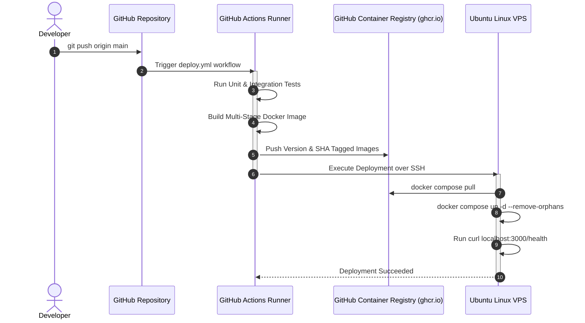

# ShipIt — Production-Grade URL Shortener & DevOps Showcase

ShipIt is a production-oriented URL shortener with click analytics, architected and built to demonstrate the complete software delivery lifecycle:

**Code → Testing → Docker → CI/CD → Container Registry (GHCR) → Ubuntu VPS → Nginx → HTTPS (Certbot) → Uptime Monitoring**

Rather than merely functioning as an in-memory toy or relying on black-box PaaS abstractions, ShipIt demonstrates enterprise-level Node.js development, PostgreSQL schema design with atomic click counting, multi-stage Docker builds, automated GitHub Actions pipelines, and bare-metal Ubuntu VPS administration over SSH with an Nginx reverse proxy.

---

## Live Demo

* **Public Web Application:** `https://[CONFIGURED_DOMAIN_OR_VPS_IP]` *(Pending VPS deployment phase)*
* **Health Check Endpoint:** `https://[CONFIGURED_DOMAIN_OR_VPS_IP]/health`
* **Status Page:** *(Pending UptimeRobot configuration)*

---

## Project Overview

* **Short Code Generation:** Cryptographically sound, collision-resistant base62 generation with retry mechanisms and database-level uniqueness enforcement.
* **Redirection & Atomic Analytics:** `GET /:code` atomically increments click counts and records last-clicked timestamps using PostgreSQL row updates.
* **REST API:** Complete CRUD lifecycle for URLs, paginated list view, and individual statistics.
* **Production Observability:** Structured logging, centralized error taxonomy, and automated external uptime monitoring.
* **Infrastructure as Code & CI/CD:** Zero manual server patching; GitHub Actions tests, packages, publishes to GitHub Container Registry (GHCR), and deploys remotely to Ubuntu via SSH.

---

## Features

- [x] **Modular Express Architecture:** Strict separation between routes, controllers, services, database models, and middleware.
- [x] **Centralized Error Handling:** Standardized error formats without leaking database credentials or stack traces in production.
- [x] **Defensive Security:** Helmet header hardening, CORS configuration, request size boundaries, and IP rate limiting.
- [ ] **PostgreSQL Persistence & Migrations:** Explicit relational tables, unique constraints, and B-Tree indexing on short codes. *(Phase 2)*
- [ ] **Atomic Click Analytics:** Concurrency-safe counter increments via SQL expressions. *(Phase 3)*
- [ ] **Comprehensive Test Suite:** Integration and unit tests using Jest and Supertest. *(Phases 1 & 5)*
- [ ] **Production Dockerization:** Multi-stage, minimal, unprivileged container execution. *(Phase 6)*
- [ ] **CI/CD Pipeline:** Automated GitHub Actions build, test, and GHCR publishing. *(Phase 7)*
- [ ] **Self-Hosted VPS Deployment:** Ubuntu host management, systemd / Docker Compose supervision. *(Phase 8)*
- [ ] **Nginx Reverse Proxy & HTTPS:** TLS termination via Let's Encrypt / Certbot with HTTP-to-HTTPS redirection. *(Phases 9 & 10)*
- [ ] **External Uptime Monitoring:** Automated synthetic pings on `/health` via UptimeRobot. *(Phase 12)*

---

## Architecture

### Application Architecture

```mermaid
graph TD
    Client(["Internet Client"]) -->|HTTPS :443| Nginx["Nginx Reverse Proxy (Ubuntu Host)"]
    Nginx -->|HTTP :3000 (Internal)| AppContainer["Node.js / Express Container"]
    AppContainer -->|PostgreSQL Protocol :5432| DBContainer["PostgreSQL Container"]
    DBContainer --> DBVolume[("Docker Named Volume\n(pgdata)")]
```

### CI/CD Deployment Architecture



---

## Tech Stack

* **Runtime:** Node.js (v20+ LTS / v24)
* **Framework:** Express.js
* **Database:** PostgreSQL with `pg` connection pooling
* **Security & Middleware:** Helmet, CORS, Express-Rate-Limit, Morgan
* **Testing:** Jest, Supertest
* **Containerization:** Docker, Docker Compose
* **Container Registry:** GitHub Container Registry (GHCR)
* **CI/CD:** GitHub Actions
* **Host Operating System:** Ubuntu Linux LTS VPS
* **Reverse Proxy & SSL:** Nginx, Certbot (Let's Encrypt)
* **Monitoring:** UptimeRobot (external `/health` probing)

---

## Project Structure

```text
shipit/
├── .github/
│   └── workflows/
│       └── deploy.yml          # GitHub Actions CI/CD pipeline
├── nginx/
│   └── default.conf            # Nginx reverse proxy configuration
├── src/
│   ├── config/
│   │   └── env.js              # Environment variables and config loading
│   ├── controllers/
│   │   ├── healthController.js # Health check logic
│   │   └── linkController.js   # Short link CRUD & redirect handlers
│   ├── db/
│   │   ├── index.js            # Connection pool & query helpers
│   │   └── migrate.js          # Database migrations & table creation
│   ├── middleware/
│   │   ├── errorHandler.js     # Centralized error & 404 middleware
│   │   ├── rateLimiter.js      # Endpoint & creation rate limiters
│   │   └── validator.js        # Input validation middleware
│   ├── routes/
│   │   ├── healthRoutes.js     # /health router
│   │   ├── linkRoutes.js       # /api/links router
│   │   └── redirectRoutes.js   # /:code redirection router
│   ├── services/
│   │   └── linkService.js      # Business logic & short code generation
│   ├── utils/
│   │   ├── errors.js           # Custom AppError hierarchy
│   │   ├── logger.js           # Structured logging
│   │   └── shortCode.js        # Base62 code generator
│   ├── app.js                  # Express app & middleware composition
│   └── server.js               # HTTP listener & graceful shutdown
├── tests/
│   ├── health.test.js          # Health endpoint & error tests
│   └── links.test.js           # Complete link lifecycle tests
├── .dockerignore
├── .env.example
├── .gitignore
├── Dockerfile                  # Multi-stage production container build
├── docker-compose.yml          # Multi-container local & VPS setup
├── INTERVIEW.md                # Comprehensive technical interview guide
├── package.json
└── README.md
```

---

## Database Schema

```sql
CREATE TABLE IF NOT EXISTS links (
  id SERIAL PRIMARY KEY,
  original_url TEXT NOT NULL,
  short_code VARCHAR(16) NOT NULL UNIQUE,
  click_count INTEGER DEFAULT 0 NOT NULL,
  last_clicked_at TIMESTAMP WITH TIME ZONE NULL,
  created_at TIMESTAMP WITH TIME ZONE DEFAULT CURRENT_TIMESTAMP NOT NULL,
  updated_at TIMESTAMP WITH TIME ZONE DEFAULT CURRENT_TIMESTAMP NOT NULL
);

CREATE INDEX IF NOT EXISTS idx_links_short_code ON links(short_code);
```

---

## API Documentation

*(Will be populated with endpoint specifications, requests, and curl examples in Phase 3)*

---

## Local Development

### 1. Prerequisites
- Node.js >= 20.x
- PostgreSQL >= 14 (or Docker)

### 2. Setup
```bash
# Clone the repository
git clone https://github.com/your-username/shipit.git
cd shipit

# Copy environment variables
cp .env.example .env

# Install dependencies
npm install

# Run tests
npm test

# Start development server
npm run dev
```

---

## Environment Variables

| Variable | Description | Default |
|---|---|---|
| `NODE_ENV` | Application environment (`development`, `test`, `production`) | `development` |
| `PORT` | Local HTTP port | `3000` |
| `BASE_URL` | Base domain for generated short links | `http://localhost:3000` |
| `DATABASE_URL` | Complete PostgreSQL connection string (optional) | - |
| `POSTGRES_HOST` | Database hostname | `localhost` |
| `POSTGRES_PORT` | Database port | `5432` |
| `POSTGRES_DB` | Database name | `shipit` |
| `POSTGRES_USER` | Database username | `postgres` |
| `POSTGRES_PASSWORD` | Database password | `postgres` |
| `RATE_LIMIT_WINDOW_MS` | Rate limiting evaluation window in ms | `900000` (15m) |
| `RATE_LIMIT_MAX` | Max requests per window | `100` |
| `RATE_LIMIT_CREATE_MAX` | Max link creation requests per window | `30` |

---

## Running with Docker

*(Details in Phase 6)*

---

## Testing

ShipIt maintains automated tests covering health checks, short link creation, collision resistance, redirection with atomic counting, statistics, pagination, and rate limiting.

```bash
# Run test suite
npm test

# Run tests in watch mode
npm run test:watch
```

---

## CI/CD Pipeline

*(Details in Phase 7 & Phase 11)*

---

## GHCR

*(Details in Phase 7)*

---

## VPS Deployment

*(Details in Phase 8)*

---

## Nginx

*(Details in Phase 9)*

---

## HTTPS

*(Details in Phase 10)*

---

## Monitoring

*(Details in Phase 12)*

---

## Security

* **Header Hardening:** Helmet automatically sets Content-Security-Policy, HSTS, X-Frame-Options, and X-Content-Type-Options.
* **Payload Size Limits:** `10kb` body ceiling prevents payload exhaustion attacks.
* **Rate Limiting:** Protects against abuse and brute-force short-code scanning.
* **Safe Error Propagation:** Detailed internal error logs; zero stack trace or database credential exposure in production responses.
* **Unprivileged Container Execution:** Docker images run under non-root user `node`.

---

## Decisions and Trade-offs

*(Detailed rationale for PostgreSQL, Docker, Ubuntu VPS, GHCR, Nginx, Let's Encrypt, and single VPS trade-offs in Phase 13)*

---

## Problems Encountered & Debugging Notes

*(To be maintained continuously throughout implementation)*

---

## Future Improvements

* Redis caching layer for ultra-low latency redirection lookups.
* Distributed sliding-window rate limiting with Redis.
* Read-replicas for PostgreSQL scaling.
* Horizontal scaling with Docker Swarm or Nomad behind a load balancer.

---

## Interview Talking Points

*(Refer to [INTERVIEW.md](file:///c:/ShipIt/INTERVIEW.md) for 25 in-depth interview questions and answers based on this implementation)*
